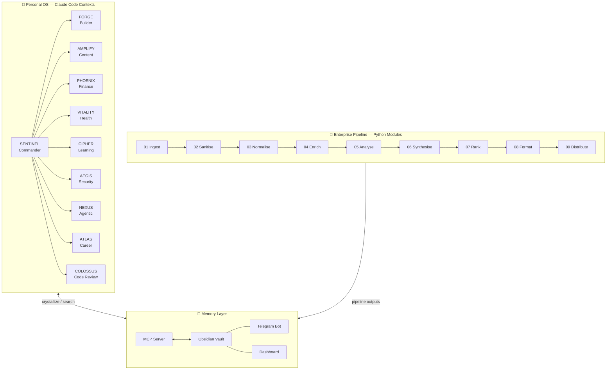
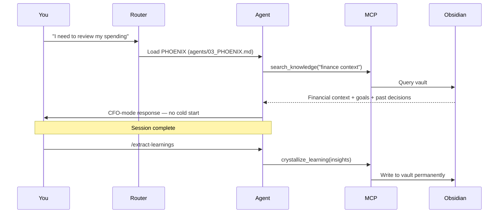
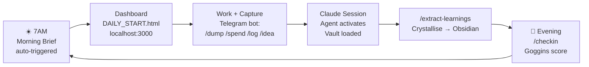
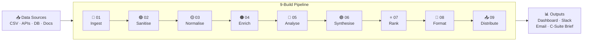
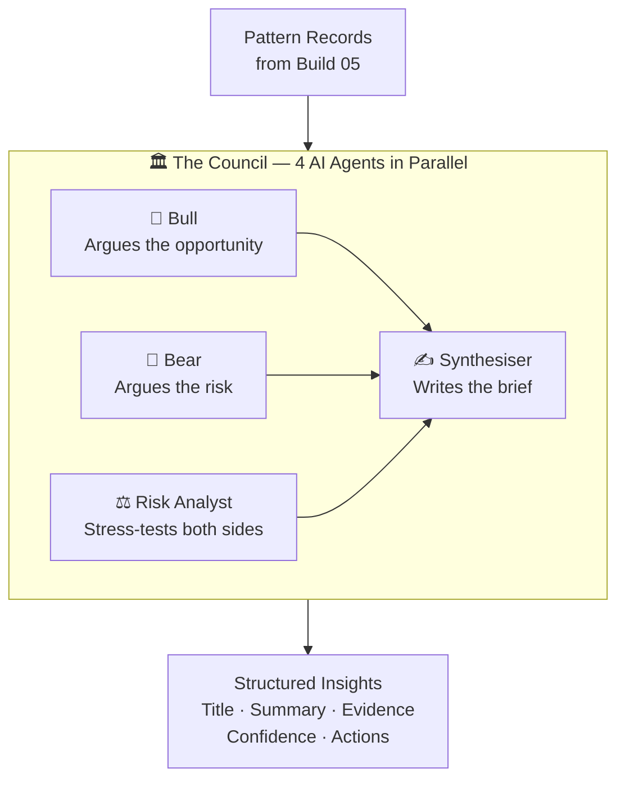

# V AgentForce (VAF)

> A personal AI operating system and enterprise data intelligence platform — built by one person, in evenings and weekends, to solve real problems.
> **Author:** Vaishali Mehmi · UK · March 2026

---

## What This Is

VAF is two things running on the same architecture:

| Layer | What It Does | Who It's For |
|-------|-------------|--------------|
| **Personal OS** | 10 specialist agents running finance, health, learning, content, career — with persistent memory via Obsidian | Me, daily |
| **Enterprise Pipeline** | 9 automated builds from raw data ingestion to stakeholder-ready insights, with multi-agent Council | Consulting clients |

Same principle. Two scales. **Structured intelligence layers with memory.**

---

## The Architecture at a Glance



---

## Layer 1 — Personal OS

The personal OS is not a chatbot. It is a set of **10 Claude Code contexts** — markdown files that define how Claude behaves in each domain. Trigger a keyword. The right agent activates.

### The 10 Agents

| Code Name | Domain | Activated By |
|-----------|--------|-------------|
| **SENTINEL** | Squad Commander · Orchestrator | "brain dump", "overwhelm", "where do I start" |
| **FORGE** | Builder · Architect · Full Dev Team | "build", "code", "ship", "deploy" |
| **AMPLIFY** | Content Creator · AI Educator | "post", "content", "LinkedIn", "video" |
| **PHOENIX** | Finance CFO · Wealth Architect | "money", "spending", "invoice", "runway" |
| **VITALITY** | Health Coach · Performance Engine | "food", "sleep", "gym", "health" |
| **CIPHER** | Learning Intelligence · Signal Decoder | "research", "learn", "insight", "paper" |
| **AEGIS** | AI Security Architect | "security", "compliance", "risk", "MAESTRO" |
| **NEXUS** | Agentic Future · MCP/A2A Specialist | "agent", "MCP", "automation", "what should I build" |
| **ATLAS** | Career · Business Strategist | "career", "client", "consulting", "rate" |
| **COLOSSUS** | Principal Engineer · Code Reviewer | "review", "is this good", "tear this apart" |

### How Memory Works



### The Daily Loop



---

## Layer 2 — Enterprise Pipeline

9 Python modules. Each does one job precisely. One command to run all of them.

```bash
./enterprise/demo.sh
```

### Pipeline Flow



### Build 06 — The Council



Four agents designed to disagree. One brief that's better for it.

### Build Summary

| Build | Name | Output |
|-------|------|--------|
| **01** | Ingest | Raw data staged from all sources |
| **02** | Sanitise | Deduplicated, validated, clean records |
| **03** | Normalise | Unified schema, canonical format |
| **04** | Enrich | Context added — relationships, metadata |
| **05** | Analyse | Patterns, anomalies, trends detected |
| **06** | Synthesise | Council runs → actionable insights |
| **07** | Rank | Insights scored by impact + novelty |
| **08** | Format | C-suite brief + full analyst report |
| **09** | Distribute | Delivered to all configured channels |

---

## Quick Start

### Personal OS

```bash
git clone https://github.com/vm799/v-agentforce-architecture
cd v-agentforce-architecture
cp .env.example .env
# Fill in: VAF_TELEGRAM_TOKEN, VAF_TELEGRAM_CHAT_ID, VAF_OBSIDIAN_VAULT_DIR, VAF_ANTHROPIC_KEY_1
./start.sh
```

Open Claude Code in the project directory. Talk normally. Agents activate from `CLAUDE.md`.

### Enterprise Pipeline

```bash
cd enterprise
./demo.sh
# Runs full 9-build pipeline + opens dashboard in browser
```

---

## Repository Structure

```
v-agentforce-architecture/
├── CLAUDE.md                    ← Router: trigger tables for 10 agents + 5 skills
├── agents/                      ← 10 agent context files (00–09)
├── skills/                      ← 8 skill files
├── enterprise/                  ← 9-build Python pipeline
│   ├── orchestrator.py
│   ├── delivery_handler.py
│   └── vaf-am-build-01/ … 09/
├── personal/
│   ├── telegram-relay/bot.py
│   └── scripts/morning-briefing.py
├── mcp/src/index.js             ← Obsidian MCP server
├── dashboard/DAILY_START.html   ← Morning dashboard
├── context/                     ← Live context (partially gitignored)
└── docs/
    ├── pitch-script.md          ← Founder-to-CTO pitch
    ├── builds/                  ← Per-build READMEs
    └── loom-scripts/            ← Video recording scripts
```

---

## The Goggins Protocol — 5 Non-Negotiables

Every day. No exceptions.

| # | Non-Negotiable | Standard |
|---|---------------|----------|
| 🔥 | **BODY** | 5×5 physical — 5 mins, zero excuses |
| 🏗️ | **BUILD** | 1 thing shipped to production |
| 🧠 | **LEARN** | 1 lesson extracted + saved to CIPHER |
| 📱 | **AMPLIFY** | 1 piece of content created or scheduled |
| 📋 | **BRIEF** | Morning brief + evening `/checkin` |

**Log nightly:** `/checkin [BODY] [BUILD] [LEARN] [AMPLIFY] [BRIEF]` via Telegram

---

## MCP Tools

| Tool | Purpose |
|------|---------|
| `search_knowledge` | Find past decisions, learnings, ADRs in Obsidian |
| `fetch_knowledge` | Load a specific vault document |
| `crystallize_learning` | Save insight permanently to vault |
| `validate_compliance` | Check against AEGIS security standards |
| `get_pipeline_status` | Enterprise pipeline run status |

---

## Building in Public — 12 Loom Videos

| # | Title | Status |
|---|-------|--------|
| 01 | What is VAF and why I built it | 🎬 Recording today |
| 02 | Claude Code as your personal OS | ⏳ |
| 03–11 | One deep dive per agent | ⏳ |
| 12 | Enterprise pipeline: full demo | ⏳ |

---

## Consulting

Working with a small number of teams who want to implement this architecture for their data intelligence pipeline.

**[LinkedIn](https://linkedin.com/in/vaishalimehmi) · [GitHub](https://github.com/vm799)**

---

*Built with Claude. Memory in Obsidian. Shipped in public.*
