# V AgentForce

### 10-agent AI operating system · Finance · Health · Content · Career · Engineering

**2.5 FTE equivalent automated · 15+ hours/week reclaimed · Running 24/7**

*Every CEO is asking what agentic AI means for their business.*
*This is what it looks like when you actually build one.*

---

## Why This Exists Now

We are in the first 18 months where agentic AI systems — systems that plan, decide, and execute autonomously — are production-ready for individuals and teams. This is not a chatbot era anymore. This is the era of autonomous AI workers.

Most companies are still in "prompt and paste" mode. They use AI reactively, one conversation at a time. The organisations that are pulling ahead are the ones building **systems**: structured, multi-agent architectures where AI handles entire workflows end-to-end, not just single responses.

V AgentForce is proof that this is real, buildable, and deployable today. It is not a demo. It is not a prototype. It runs every day, handling finance analysis, content production, health tracking, career strategy, and engineering — simultaneously, autonomously, and without manual intervention.

---

## The 10 Agents

Each agent is a specialist. SENTINEL orchestrates — all others execute within their domain. Every agent has a defined persona, activation triggers, and a decision protocol.

| Agent | Domain | Role |
|---|---|---|
| **SENTINEL** | Command | Master orchestrator — receives every request and routes it to the right agent |
| **FORGE** | Engineering | VP of Engineering — architects systems, leads the virtual dev team, ships products |
| **PHOENIX** | Finance | Personal CFO — bank statement analysis, budgeting, wealth building strategy |
| **VITALITY** | Health | Health coach — nutrition, fitness, energy optimisation, daily check-ins |
| **AMPLIFY** | Content | Content team lead — writes, edits, and publishes across all channels |
| **CIPHER** | Security | Security lead — protects systems, data, and digital identity |
| **NEXUS** | Intelligence | Research engine — synthesises knowledge, curates signals, fights noise |
| **ATLAS** | Career | Career strategist — job hunting, promotion campaigns, networking |
| **COLOSSUS** | Scale | Infrastructure lead — deployment, scaling, system reliability |
| **LIBRARIAN** | Memory | Knowledge keeper — manages the Obsidian vault and knowledge graph |

---

## Architecture

V AgentForce follows a hub-and-spoke orchestration model. All input flows through SENTINEL, which classifies the request and dispatches to the appropriate domain agent. Agents return structured outputs that are persisted and surfaced via the dashboard.

```mermaid
flowchart TD
    U([" User<br/>Telegram · React Dashboard "])

    U --> S

    subgraph Core ["  SENTINEL — Orchestration Layer  "]
        S(["SENTINEL<br/>Classifies · Routes · Coordinates"])
    end

    S --> F & PH & V & AM & AT

    subgraph Domains ["  Domain Agents  "]
        F(["FORGE<br/>Engineering"])
        PH(["PHOENIX<br/>Finance"])
        V(["VITALITY<br/>Health"])
        AM(["AMPLIFY<br/>Content"])
        AT(["ATLAS<br/>Career"])
    end

    F & PH & V & AM & AT --> OUT

    subgraph Output ["  Output & Persistence Layer  "]
        OUT(["FastAPI · SQLite · Obsidian Vault · External APIs"])
    end

    style Core fill:#1c1c2e,stroke:#a78bfa,color:#e2e8f0
    style Domains fill:#0f1a0f,stroke:#4ade80,color:#e2e8f0
    style Output fill:#1a1000,stroke:#fbbf24,color:#e2e8f0
    style U fill:#1e3a5f,stroke:#60a5fa,color:#e2e8f0
    style S fill:#2d1b4e,stroke:#a78bfa,color:#e2e8f0
    style F fill:#14291a,stroke:#4ade80,color:#e2e8f0
    style PH fill:#14291a,stroke:#4ade80,color:#e2e8f0
    style V fill:#14291a,stroke:#4ade80,color:#e2e8f0
    style AM fill:#14291a,stroke:#4ade80,color:#e2e8f0
    style AT fill:#14291a,stroke:#4ade80,color:#e2e8f0
    style OUT fill:#2d1f00,stroke:#fbbf24,color:#e2e8f0
```

---

## Results & ROI

V AgentForce replaces the work of multiple specialist roles across five life domains — running continuously, without fatigue, at a fraction of the cost of hiring.

### 2.5 FTE equivalent automated

### 15+ hours/week reclaimed

### 10 agents · 5 domains · running 24/7

**Where the time comes from:**
- **Finance** — automatic statement analysis, monthly reporting, investment tracking
- **Health** — daily check-ins processed, nutrition and energy optimisation
- **Content** — research, drafts, edits, and scheduling handled end-to-end
- **Career** — opportunity pipeline managed, applications and networking tracked
- **Engineering** — architecture decisions, code reviews, product scoping

---

## Tech Stack

| Layer | Technology |
|---|---|
| **Backend API** | Python 3.12 · FastAPI · Uvicorn |
| **Frontend** | React 18 · TypeScript · Vite |
| **AI** | Claude API (Anthropic) · Prompt engineering |
| **Interface** | Telegram Bot API · React dashboard |
| **Storage** | SQLite · Obsidian vault (Markdown) |
| **Scheduling** | macOS LaunchAgents · async Python |
| **Infrastructure** | Local-first · Cloudflare tunnel for remote access |

---

## Hire Me · Work With Me

| Looking for my next role | Building AI systems for companies |
|:---:|:---:|
| I am a senior finance professional with deep AI engineering capability. I bridge the gap between business strategy and production AI systems — rare in a market full of specialists on one side or the other. | I help companies design and deploy agentic AI systems — from strategy and architecture through to a working, shipped product. If your leadership team is asking "what does AI mean for us?", I can answer that question and build the answer. |
| [**Connect on LinkedIn →**](https://linkedin.com/in/vaishali-mehmi) 

---

Built with Python · FastAPI · React · Claude API · Telegram · Obsidian
 
V AgentForce — personal AI operating system

