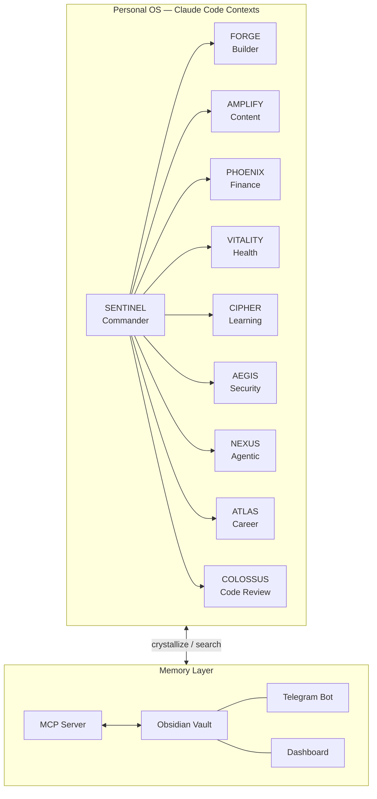
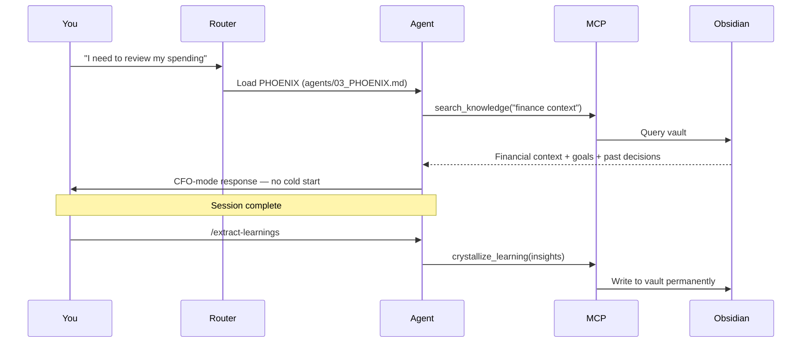
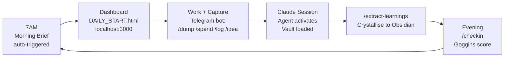

# V AgentForce — Personal AI Operating System

> 10 specialist AI agents running finance, health, learning, content, security, and career — with persistent memory via Obsidian. Built by one person, in evenings and weekends.
> **Author:** Vaishali Mehmi · UK · March 2026

> **Enterprise pipeline?** See [v-enterprise-architecture](https://github.com/vm799/v-enterprise-architecture) repo.

---

## What This Is

VAF is a **personal AI operating system** — a set of 10 Claude Code contexts (markdown files) that define how Claude behaves in each domain of life. Trigger a keyword. The right agent activates. Memory persists via Obsidian.

---

## Architecture



---

## The 10 Agents

| Code Name | Domain | Activated By |
|-----------|--------|-------------|
| **SENTINEL** | Squad Commander · Orchestrator | "brain dump", "overwhelm", "where do I start" |
| **FORGE** | Builder · Architect · Full Dev Team | "build", "code", "ship", "deploy" |
| **AMPLIFY** | Content Creator · AI Educator | "post", "content", "LinkedIn", "video" |
| **PHOENIX** | Finance CFO · Wealth Architect | "money", "spending", "invoice", "runway" |
| **VITALITY** | Health Coach · Performance Engine | "food", "sleep", "gym", "health" |
| **CIPHER** | Learning Intelligence · Signal Decoder | "research", "learn", "insight", "paper" |
| **AEGIS** | AI Security Architect | "security", "compliance", "risk", "MAESTRO" |
| **NEXUS** | Agentic Future · MCP/A2A Specialist | "agent", "MCP", "automation", "what should I build" |
| **ATLAS** | Career · Business Strategist | "career", "client", "consulting", "rate" |
| **COLOSSUS** | Principal Engineer · Code Reviewer | "review", "is this good", "tear this apart" |

---

## How Memory Works



---

## The Daily Loop



---

## The Goggins Protocol — 5 Non-Negotiables

Every day. No exceptions.

| # | Non-Negotiable | Standard |
|---|---------------|----------|
| 1 | **BODY** | 5x5 physical — 5 mins, zero excuses |
| 2 | **BUILD** | 1 thing shipped to production |
| 3 | **LEARN** | 1 lesson extracted + saved to CIPHER |
| 4 | **AMPLIFY** | 1 piece of content created or scheduled |
| 5 | **BRIEF** | Morning brief + evening `/checkin` |

**Log nightly:** `/checkin [BODY] [BUILD] [LEARN] [AMPLIFY] [BRIEF]` via Telegram

---

## MCP Tools

| Tool | Purpose |
|------|---------|
| `search_knowledge` | Find past decisions, learnings, ADRs in Obsidian |
| `fetch_knowledge` | Load a specific vault document |
| `crystallize_learning` | Save insight permanently to vault |
| `validate_compliance` | Check against AEGIS security standards |

---

## Quick Start

```bash
git clone https://github.com/vm799/v-agentforce-architecture
cd v-agentforce-architecture
cp .env.example .env
# Fill in: VAF_TELEGRAM_TOKEN, VAF_TELEGRAM_CHAT_ID, VAF_OBSIDIAN_VAULT_DIR, VAF_ANTHROPIC_KEY_1
./start.sh
```

Open Claude Code in the project directory. Talk normally. Agents activate from `CLAUDE.md`.

---

## Repository Structure

```
v-agentforce-architecture/
├── CLAUDE.md                    <- Router: trigger tables for 10 agents + 5 skills
├── agents/                      <- 10 agent context files (00-09)
├── skills/                      <- Skill files
├── personal/
│   ├── telegram-relay/bot.py
│   └── scripts/morning-briefing.py
├── mcp/src/index.js             <- Obsidian MCP server
├── dashboard/                   <- Morning dashboard + agent visualisations
├── context/                     <- Live context (partially gitignored)
│   ├── WHO_I_AM.md
│   ├── GOALS_2026.md
│   └── OBSIDIAN_VAULT_STRUCTURE.md
└── docs/
    ├── pitch-script.md          <- Founder-to-CTO pitch
    └── loom-scripts/            <- Video recording scripts
```

---

## Building in Public — 12 Loom Videos

| # | Title | Status |
|---|-------|--------|
| 01 | What is VAF and why I built it | Recording |
| 02 | Claude Code as your personal OS | Planned |
| 03-11 | One deep dive per agent | Planned |
| 12 | Full system walkthrough | Planned |

---

## Consulting

Working with a small number of teams who want to implement this architecture for their data intelligence pipeline. Enterprise pipeline details: [v-enterprise-architecture](https://github.com/vm799/v-enterprise-architecture).

**[LinkedIn](https://linkedin.com/in/vaishalimehmi) · [GitHub](https://github.com/vm799)**

---

*Built with Claude. Memory in Obsidian. Shipped in public.*
