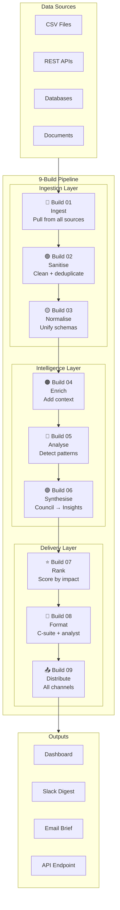
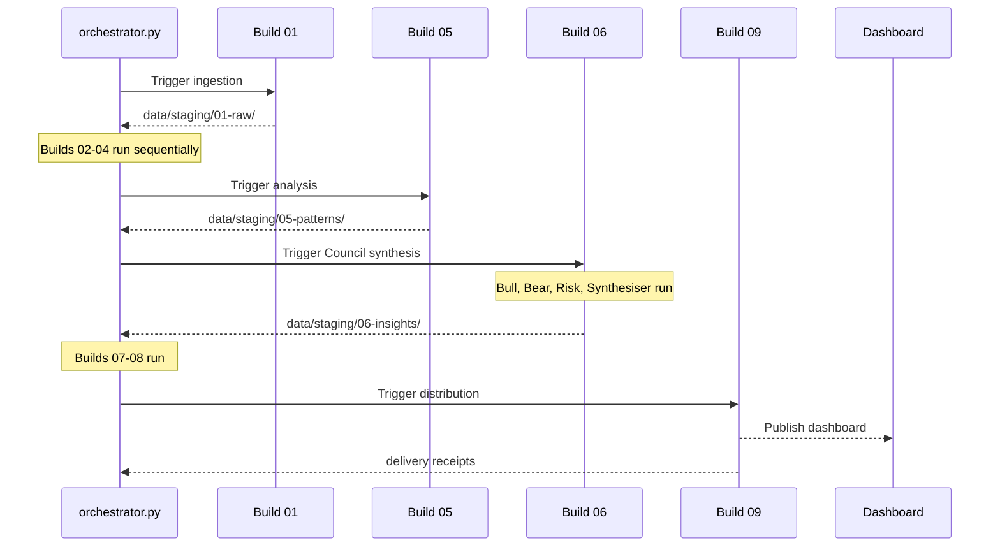

# VAF Enterprise Pipeline — Overview

> 9 automated builds. One command. Raw data to stakeholder-ready intelligence.

---

## What It Does

The VAF AM (Asset Management) pipeline is a modular Python system that transforms raw, unstructured data from multiple sources into structured, actionable intelligence delivered to the right people in the right format.

It was built for one purpose: **eliminate the gap between data existing and intelligence flowing.**

---

## Architecture



---

## The Three Layers

### Layer 1 — Ingestion (Builds 01–03)
Get data in, clean it, make it consistent.

| Build | Job | Why It Matters |
|-------|-----|---------------|
| 01 | Pull data from all sources | Nothing works without data in |
| 02 | Remove junk, deduplicate | Garbage in = garbage out |
| 03 | Unify schemas | Can't analyse what you can't compare |

### Layer 2 — Intelligence (Builds 04–06)
Transform clean data into meaning.

| Build | Job | Why It Matters |
|-------|-----|---------------|
| 04 | Add context + relationships | Raw data has no narrative |
| 05 | Find patterns + anomalies | The signal buried in the noise |
| 06 | Council synthesises insights | Four AI agents produce better analysis than one |

### Layer 3 — Delivery (Builds 07–09)
Get the right output to the right people.

| Build | Job | Why It Matters |
|-------|-----|---------------|
| 07 | Score insights by impact | Not all findings are equal |
| 08 | Write for each audience | C-suite brief ≠ analyst report |
| 09 | Distribute across all channels | Intelligence that isn't delivered doesn't count |

---

## Running the Pipeline

```bash
# Full pipeline with dashboard
./demo.sh

# Or directly
cd enterprise
python3 orchestrator.py run --mode with-dashboard

# Ingestion only (for testing)
python3 orchestrator.py run --mode ingestion-only
```

---

## Data Flow



---

## Build Statuses (Dashboard)

The auto-generated dashboard tracks every build run:

- **Status:** PASS / FAIL / SKIP
- **Duration:** Time per build
- **Records In/Out:** Volume at each stage
- **Data Quality Score:** 0–100 per build
- **Timestamp:** UTC, every run

---

## Configuration

```
enterprise/
├── config/
│   ├── sources.json         ← Data source connections
│   ├── stakeholders/
│   │   ├── contacts.json    ← Who gets what
│   │   └── profiles.json    ← Stakeholder interest profiles
│   ├── delivery.json        ← Channel configurations
│   └── distribution/
│       └── rules.json       ← When + how to deliver
```

---

## Individual Build Docs

- [Build 01 — Ingestion](01-ingestion.md)
- [Build 02 — Sanitisation](02-sanitisation.md)
- [Build 03 — Normalisation](03-normalisation.md)
- [Build 04 — Enrichment](04-enrichment.md)
- [Build 05 — Analysis](05-analysis.md)
- [Build 06 — Synthesis (Council)](06-synthesis.md)
- [Build 07 — Ranking](07-ranking.md)
- [Build 08 — Formatting](08-formatting.md)
- [Build 09 — Distribution](09-distribution.md)
- [Build 10 — Self-Healing Loop](10-self-healing-spec.md) *(planned)*
