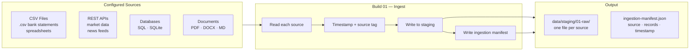

# Build 01 — Ingestion

> **Pull data from every configured source into a single staging area.**

| Field | Value |
|-------|-------|
| **Spec ID** | VAF-AM-SPEC-01 |
| **Status** | Production |
| **Position** | First build — nothing runs without it |
| **Feeds Into** | Build 02 (Sanitisation) |

---

## What It Does

Build 01 is the pipeline's front door. Every data source — CSV files, REST APIs, databases, document stores — gets pulled here. Nothing sophisticated happens in this build. Its entire job is: **get the data in, and record exactly what arrived.**

---

## Flow



---

## Inputs

- Source configuration: `config/sources.json`
- Data files or API credentials per source type

## Outputs

- Raw staged files: `data/staging/01-raw/`
- Ingestion manifest: `data/staging/01-raw/ingestion-manifest.json`

## Manifest Format

```json
{
  "run_id": "2026-03-27T07:00:00Z",
  "sources": [
    {
      "source_id": "first-direct-csv",
      "type": "csv",
      "records_ingested": 142,
      "timestamp": "2026-03-27T07:00:03Z",
      "status": "success"
    }
  ],
  "total_records": 142,
  "duration_seconds": 4.2
}
```

---

## Validation Rules

- [ ] Every configured source attempted (no silent skips)
- [ ] Ingestion manifest created with timestamp per source
- [ ] Raw files written to `01-raw/` before build exits
- [ ] Partial failures logged — pipeline does not halt on one bad source

## Success Criteria

- [ ] At least one source successfully ingested
- [ ] Manifest present and parseable
- [ ] Build completes in under 60 seconds for standard source list

---

## What Can Go Wrong

| Failure | Behaviour |
|---------|-----------|
| Source unreachable (API down) | Log failure, continue with other sources |
| File not found | Log warning, skip — don't halt pipeline |
| Auth failure | Log error with source name, skip |
| Empty source | Ingest zero records, log as warning |
