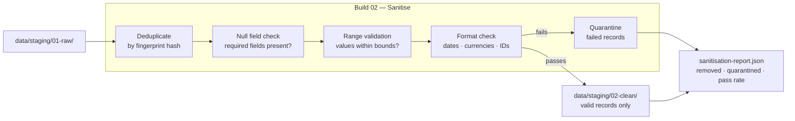

# Build 02 — Sanitisation

> **Remove junk. Deduplicate. Validate. Clean data in, clean data out.**

| Field | Value |
|-------|-------|
| **Spec ID** | VAF-AM-SPEC-02 |
| **Requires** | Build 01 (Ingestion) |
| **Feeds Into** | Build 03 (Normalisation) |

---

## What It Does

Build 02 is a filter. It takes everything Build 01 staged and removes anything that would corrupt downstream analysis: duplicate records, null-field records, malformed entries, data outside valid ranges.

**Principle:** Fix what can be fixed. Flag what can't. Never silently discard.

---

## Flow

---

## Validation Rules

- [ ] No duplicate records in output (fingerprint dedup)
- [ ] All required fields present on every output record
- [ ] Quarantine log contains every removed record with removal reason
- [ ] Pass rate reported — pipeline flags if below 80%
- [ ] Zero silently discarded records (every removal traceable)

## Success Criteria

- [ ] Output record count ≤ input record count
- [ ] Sanitisation report present with pass/quarantine counts
- [ ] Quarantine rate below 20% (above = source quality problem)
- [ ] Build completes in under 30 seconds for standard volume
