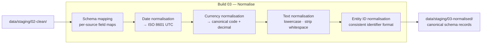

# Build 03 — Normalisation

> **Unify schemas. Standardise formats. Make everything comparable.**

| Field | Value |
|-------|-------|
| **Spec ID** | VAF-AM-SPEC-03 |
| **Requires** | Build 02 (Sanitisation) |
| **Feeds Into** | Build 04 (Enrichment) |

---

## What It Does

Build 02 removes bad data. Build 03 makes good data consistent. Different sources use different formats — dates as DD/MM/YYYY or YYYY-MM-DD, currencies as "GBP" or "£" or "826", company names with different casing. Build 03 maps everything to a single canonical schema.

**Without this:** you can't join records from different sources. Patterns become invisible.

---

## Flow

---

## Canonical Schema (Key Fields)

| Field | Standard | Example |
|-------|----------|---------|
| `date` | ISO 8601 UTC | `2026-03-27T00:00:00Z` |
| `currency` | ISO 4217 + decimal | `{"code": "GBP", "amount": 1234.56}` |
| `entity_name` | Lowercase, stripped | `"barclays bank uk plc"` |
| `entity_id` | Prefixed type:id | `"company:00026167"` |

---

## Success Criteria

- [ ] All output records match canonical schema (validated against JSON schema)
- [ ] Zero source-specific field names in output
- [ ] Date fields all parse as valid ISO 8601
- [ ] Schema validation report present with field coverage per source
