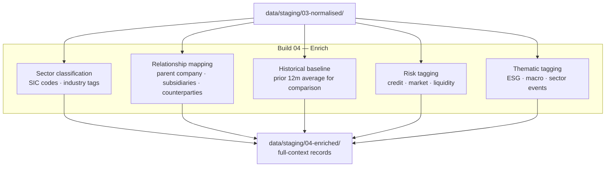

# Build 04 — Enrichment

> **Add context, relationships, and meaning that raw data doesn't contain.**

| Field | Value |
|-------|-------|
| **Spec ID** | VAF-AM-SPEC-04 |
| **Requires** | Build 03 (Normalisation) |
| **Feeds Into** | Build 05 (Analysis) |

---

## What It Does

A transaction is a number. Enrichment turns it into a story. Build 04 adds the context that makes analysis possible: sector classifications, entity relationships, historical baselines, risk tags, and thematic labels.

**A record without enrichment is a fact. A record with enrichment is intelligence.**

---

## Flow

---

## Enrichment Sources

| Enrichment Type | Source |
|----------------|--------|
| Sector / industry | Configurable classification taxonomy |
| Entity relationships | Relationship graph (config/relationships/) |
| Historical baseline | data/archive/ (prior runs) |
| Risk tags | Configurable risk rule sets |
| Thematic tags | Configurable theme dictionaries |

---

## Success Criteria

- [ ] At least 80% of records receive sector classification
- [ ] Entity relationship graph populated for all known entities
- [ ] Historical baseline found for at least 60% of records
- [ ] Enrichment coverage report present (% enriched per field)
- [ ] Build completes in under 5 minutes for standard volume
