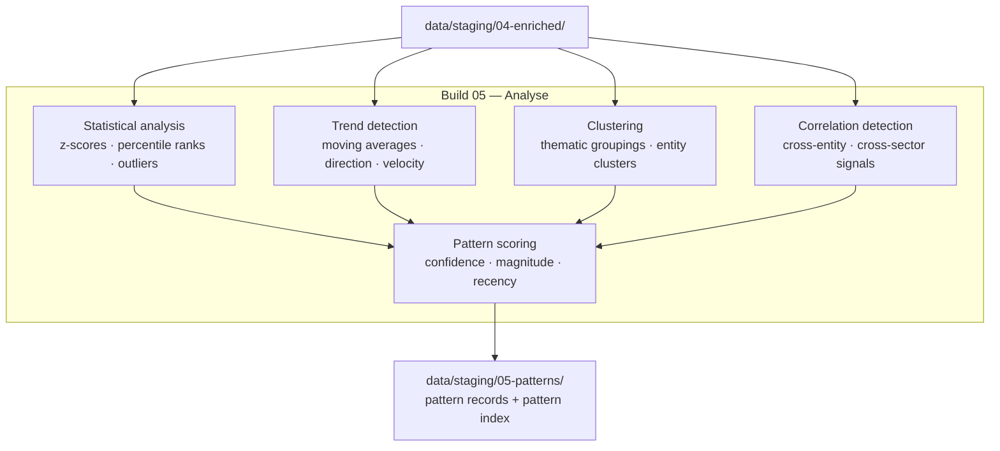

# Build 05 — Analysis

> **Find patterns, anomalies, and trends. Surface the signal in the noise.**

| Field | Value |
|-------|-------|
| **Spec ID** | VAF-AM-SPEC-05 |
| **Requires** | Build 04 (Enrichment) |
| **Feeds Into** | Build 06 (Synthesis / Council) |

---

## What It Does

Build 05 is the first build where intelligence is generated rather than transformed. It runs statistical and pattern-detection algorithms across enriched records to find:

- **Anomalies** — things that deviate from baseline
- **Trends** — directional changes over time
- **Clusters** — groups of related activity
- **Correlations** — entities or events moving together

These patterns feed the Council in Build 06. Better patterns = better insights.

---

## Flow



---

## Pattern Record Format

```json
{
  "pattern_id": "trend-001",
  "type": "trend",
  "description": "Consistent upward movement in sector X over 30 days",
  "entities": ["entity:abc", "entity:def"],
  "confidence": 0.87,
  "magnitude": "high",
  "supporting_records": ["rec-001", "rec-045", "rec-107"],
  "timeframe": {"start": "2026-02-25", "end": "2026-03-27"}
}
```

---

## Success Criteria

- [ ] Pattern records produced for at least 10% of enriched record set
- [ ] Confidence scores in range [0.0, 1.0]
- [ ] Pattern index present listing all patterns by type
- [ ] Anomalies flagged when confidence > 0.7 and magnitude = "high"
- [ ] Build completes in under 10 minutes for standard volume
