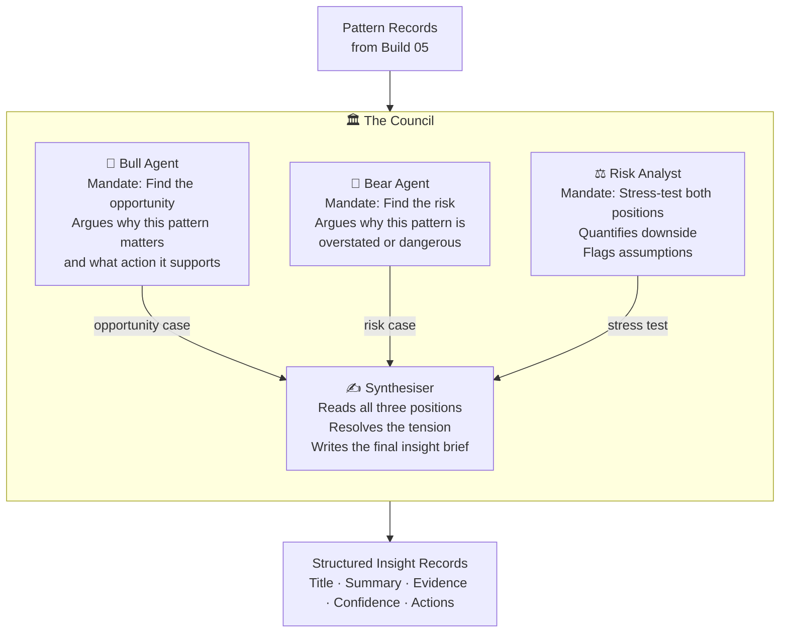

# Build 06 — Synthesis (The Council)

> **Four AI agents debate patterns. One brief emerges. Better than any single model.**

| Field | Value |
|-------|-------|
| **Spec ID** | VAF-AM-SPEC-06 |
| **Requires** | Build 05 (Analysis) |
| **Feeds Into** | Build 07 (Ranking) |

---

## What It Does

Build 06 is the intelligence core of the pipeline. It takes the pattern records from Build 05 and runs them through a **Council of four AI agents**, each with a different mandate. They don't agree — they're designed not to. The tension between their perspectives produces insights that are more robust than any single model's output.

After the Council runs, insights are structured with confidence scores, supporting evidence, and recommended actions, then matched against historical precedents.

---

## The Council



---

## Insight Record Format

```json
{
  "insight_id": "insight-001",
  "title": "Sector X showing structural shift, not cyclical",
  "executive_summary": "Three converging patterns suggest...",
  "detailed_analysis": "Bull position: ... Bear position: ... Risk view: ...",
  "supporting_patterns": ["trend-001", "cluster-003"],
  "confidence": 0.84,
  "novelty_score": 0.71,
  "recommended_actions": [
    "Review exposure to sector X by end of week",
    "Alert risk committee if correlation persists"
  ],
  "historical_precedents": ["insight-2025-11-003"],
  "stakeholder_tags": ["risk-committee", "portfolio-managers"]
}
```

---

## Why Four Agents, Not One

| Approach | Problem |
|----------|---------|
| Single model | Confirmation bias — tends to agree with dominant signal |
| Bull + Bear only | Missing risk quantification |
| Bull + Bear + Risk | Missing synthesis — three documents, not one insight |
| **Council of four** | Structured disagreement → structured resolution |

---

## Success Criteria

- [ ] At least 5 actionable insights per pipeline run
- [ ] All four Council agents invoked per insight group
- [ ] Confidence scores computed from constituent pattern confidence
- [ ] Precedent matching finds historical parallels for ≥60% of insights
- [ ] Synthesis completes in under 10 minutes
