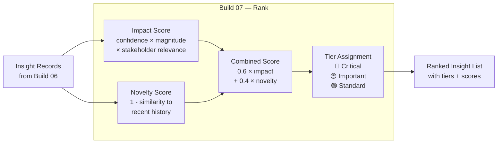

# Build 07 — Ranking

> **Score every insight. Prioritise ruthlessly. Not all findings are equal.**

| Field | Value |
|-------|-------|
| **Spec ID** | VAF-AM-SPEC-07 |
| **Requires** | Build 06 (Synthesis) |
| **Feeds Into** | Build 08 (Formatting) |

---

## What It Does

The Council produces insights. Build 07 determines which ones matter most. It scores each insight on two dimensions — **impact** (how significant is this?) and **novelty** (how different is this from what we've seen before?) — then produces a ranked list that drives delivery priority in Builds 08 and 09.

**High impact + high novelty = top of the brief.**

---

## Scoring Model



---

## Scoring Formula

```
impact_score    = confidence × magnitude_weight × stakeholder_relevance
novelty_score   = 1.0 - max_similarity_to_recent_30d

combined_score  = (0.6 × impact_score) + (0.4 × novelty_score)
```

**Tier thresholds:**
- 🔴 **Critical** → combined_score ≥ 0.80 (immediate delivery)
- 🟡 **Important** → combined_score ≥ 0.55 (same-day delivery)
- 🟢 **Standard** → combined_score < 0.55 (batch delivery)

---

## Success Criteria

- [ ] Every insight from Build 06 receives a combined score
- [ ] At least one 🔴 Critical insight flagged per run (if patterns warrant)
- [ ] Ranked list produced and passed to Build 08
- [ ] Ranking report saved with full scoring breakdown
