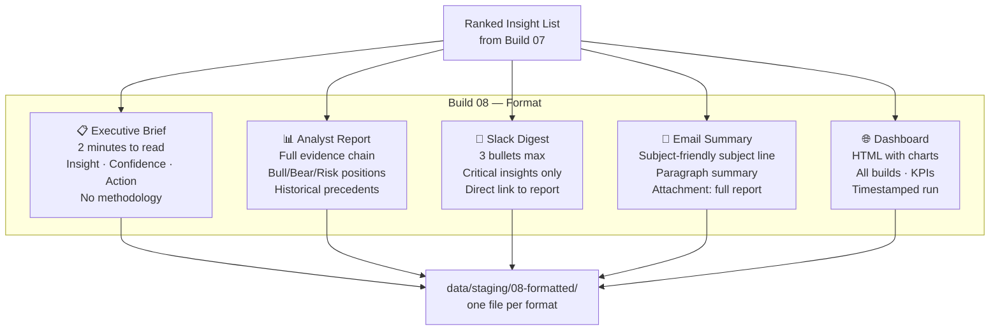

# Build 08 — Formatting

> **Write for the audience. C-suite brief ≠ analyst report ≠ Slack digest.**

| Field | Value |
|-------|-------|
| **Spec ID** | VAF-AM-SPEC-08 |
| **Requires** | Build 07 (Ranking) |
| **Feeds Into** | Build 09 (Distribution) |

---

## What It Does

Intelligence without communication is useless. Build 08 takes ranked insights and writes them in the format each audience actually needs. A C-suite executive doesn't want methodology — they want a decision. An analyst needs the evidence. A Slack channel needs three bullets max.

Build 08 applies audience-specific templates to produce each format from the same underlying insight.

---

## Audience Formats



---

## Executive Brief Template

```markdown
# Intelligence Brief — [Date]
**Pipeline Run:** [run-id] · **Confidence:** [avg score]

## Critical Findings ([count])
### [Insight Title]
[2–3 sentence summary]
**Recommended action:** [specific action]
**Confidence:** [score] · **Priority:** 🔴/🟡/🟢

## What This Means
[One paragraph connecting all findings]

---
*Full analyst report: [link]*
```

---

## Success Criteria

- [ ] Executive brief ≤ 600 words
- [ ] All Critical (🔴) insights appear in every format
- [ ] Analyst report contains full Bull/Bear/Risk positions
- [ ] Dashboard HTML valid and self-contained (no external dependencies at render time)
- [ ] All formats written in under 5 minutes total
