# Build 09 — Distribution

> **Deliver to the right people, on the right channel, with retry and receipt.**

| Field | Value |
|-------|-------|
| **Spec ID** | VAF-AM-SPEC-09 |
| **Requires** | Build 08 (Formatting) |
| **Feeds Into** | Stakeholders · Dashboard · Archive |

---

## What It Does

Build 09 is the last mile. It takes formatted outputs and delivers them — email, Slack, Teams, dashboard publish, API update, file drop. It retries on transient failures, records delivery receipts for compliance, and archives the full pipeline run.

**A pipeline that doesn't deliver has no value. Build 09 closes the loop.**

---

## Delivery Channels

```mermaid
graph LR
    IN["Formatted Outputs\nfrom Build 08"]

    subgraph B09["Build 09 — Distribute"]
        MAP[Load stakeholder\ncontact registry]
        RULES[Apply distribution\nrules + schedules]

        subgraph CHANNELS["Channels"]
            EMAIL["📧 Email\nbrief as body\nreport as attachment"]
            SLACK["💬 Slack\nnotification digest\nthread for critical alerts"]
            DASH["🌐 Dashboard\npublish HTML\nto configured endpoint"]
            API["🔌 API\nupdate insight endpoint\nfor downstream consumers"]
            FILE["📁 File Drop\nshared storage\nnetwork or cloud"]
        end

        RETRY["Retry Logic\n3 attempts\nexponential backoff"]
        RECEIPT["Delivery Receipts\ntimestamp · channel\nrecipient · status"]
        ARCHIVE["Archive\nfull pipeline run\ndata/archive/runs/"]
    end

    OUT["Delivery receipts\nDistribution summary\nCompliance archive"]

    IN --> MAP --> RULES --> CHANNELS --> RETRY
    RETRY -->|"success"| RECEIPT
    RETRY -->|"3 failures"| RECEIPT
    RECEIPT --> ARCHIVE
    ARCHIVE --> OUT
```



---

## Delivery Receipt Format

```json
{
  "receipt_id": "rcpt-001",
  "run_id": "2026-03-27T07:00:00Z",
  "channel": "slack",
  "recipient": "#risk-committee",
  "format": "digest",
  "timestamp": "2026-03-27T07:14:32Z",
  "status": "delivered",
  "attempts": 1,
  "message_id": "slack-msg-abc123"
}
```

---

## Distribution Rules (config/distribution/rules.json)

| Priority Tier | Delivery Behaviour |
|--------------|-------------------|
| 🔴 Critical | Immediate — all channels — within 5 minutes of pipeline |
| 🟡 Important | Same-day — primary channels — within business hours |
| 🟢 Standard | Batch — end of day — email + dashboard only |

---

## Compliance Archive

Every pipeline run is archived to `data/archive/runs/{run-id}/`:
- All 9 builds' staging outputs
- Delivery receipts
- Pipeline manifest
- Retained per configured retention policy (default: 90 days)

---

## Success Criteria

- [ ] Every configured stakeholder receives at least one delivery attempt
- [ ] Delivery receipt exists for every attempt
- [ ] Critical insights delivered within 5 minutes of pipeline completion
- [ ] Retry activates only on transient failures (not auth/address errors)
- [ ] Compliance archive passes retention policy validation
- [ ] Distribution summary report present with success/failure counts
