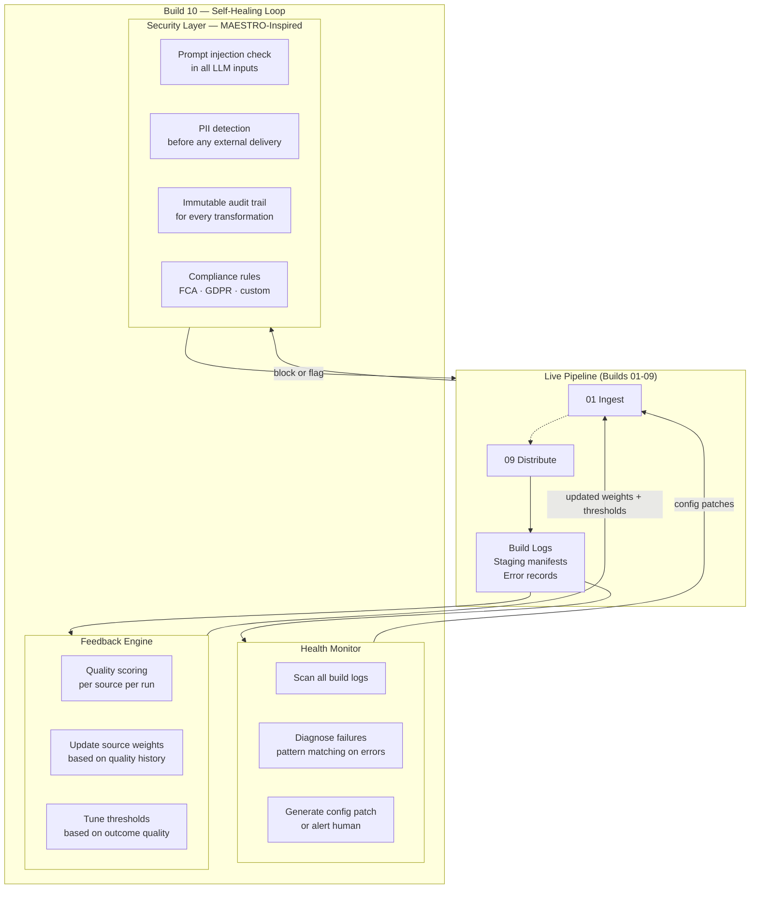
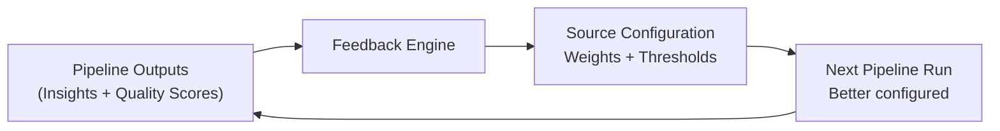

# Build 10 — Self-Healing Loop (Planned · Not Built)

> **Close the feedback loop. Make the pipeline learn from every run. Bake security into every build.**

| Field | Value |
|-------|-------|
| **Spec ID** | VAF-AM-SPEC-10 |
| **Status** | ⚠️ PLANNED — code does not exist yet |
| **Requires** | Build 09 (Distribution) outputs + all prior build logs |
| **Feeds Into** | Build 01 (next run) + all build configs |

---

## Why This Matters

The current pipeline (Builds 01–09) runs well — but it runs **the same way every time**. It doesn't learn from failures. It doesn't adapt when data quality degrades. It doesn't automatically tighten its own rules when anomalies are detected. And security validation is scattered, not systematic.

Build 10 closes all three gaps:
1. **Self-healing** — detect build failures, diagnose root cause, patch config, retry
2. **Feedback loop** — use pipeline outputs to improve pipeline inputs on next run
3. **Security layer** — MAESTRO-inspired validation at every build boundary

---

## Architecture



---

## Component 1 — Self-Healing

When a build fails, Build 10 doesn't just log it. It diagnoses it.

| Failure Pattern | Auto-Response |
|----------------|--------------|
| Source unreachable (3+ runs) | Reduce source weight, alert operator |
| Sanitisation quarantine rate > 30% | Flag source for schema review |
| Analysis produces 0 patterns | Widen pattern detection thresholds |
| Council timeout | Reduce insight batch size, retry |
| Distribution failure (channel) | Switch to fallback channel |

```python
# Conceptual — not yet implemented
class SelfHealingMonitor:
    def diagnose(self, build_logs: List[BuildLog]) -> List[Patch]:
        """Scan logs, identify failure patterns, generate config patches"""
        ...

    def apply_patch(self, patch: Patch) -> None:
        """Update config files for next run"""
        ...
```

---

## Component 2 — Feedback Loop

The pipeline improves its own inputs based on output quality.



**What it learns:**
- Which data sources consistently produce high-quality enriched records
- Which pattern detection thresholds produce actionable (not trivial) insights
- Which insights were acted on by stakeholders (requires engagement signal)

---

## Component 3 — Security Layer (MAESTRO-Inspired)

MAESTRO is the AI threat modelling framework. Build 10's security layer applies it at every build boundary.

| Threat | Where | Mitigation |
|--------|-------|-----------|
| Prompt injection | Build 06 (LLM inputs) | Sanitise all data before passing to Council agents |
| PII leakage | Build 09 (Distribution) | PII scanner before every delivery |
| Data poisoning | Build 01 (Ingestion) | Source provenance validation |
| Model manipulation | Build 06 (Council) | Output schema validation, refuse malformed responses |
| Audit trail gaps | All builds | Immutable log write at every build boundary |

---

## What Needs to Be Built

- [ ] `enterprise/vaf-am-build-10-self-healing/` — Python module
- [ ] `enterprise/vaf-am-build-10-self-healing/health_monitor.py`
- [ ] `enterprise/vaf-am-build-10-self-healing/feedback_engine.py`
- [ ] `enterprise/vaf-am-build-10-self-healing/security_layer.py`
- [ ] Integration into `orchestrator.py` — Build 10 runs after Build 09, feeds back to Build 01 config
- [ ] `config/security/maestro-rules.json` — configurable security ruleset
- [ ] Tests for all three components

**Estimated build:** 1–2 focused sessions with FORGE agent.

---

## Why It Wasn't Built Yet

The first nine builds establish the pipeline. Build 10 makes the pipeline resilient. The correct order is:
1. Build the pipeline (Builds 01–09) ✅
2. Prove it works (demo.sh) ✅
3. Make it self-improving (Build 10) ← you are here

Building self-healing before you know what fails is premature. Now that the pipeline runs, Build 10 has real failure data to design against.

---

*Raise a FORGE session with the prompt: "FORGE — build VAF-AM-SPEC-10 self-healing loop. Start with health_monitor.py."*
